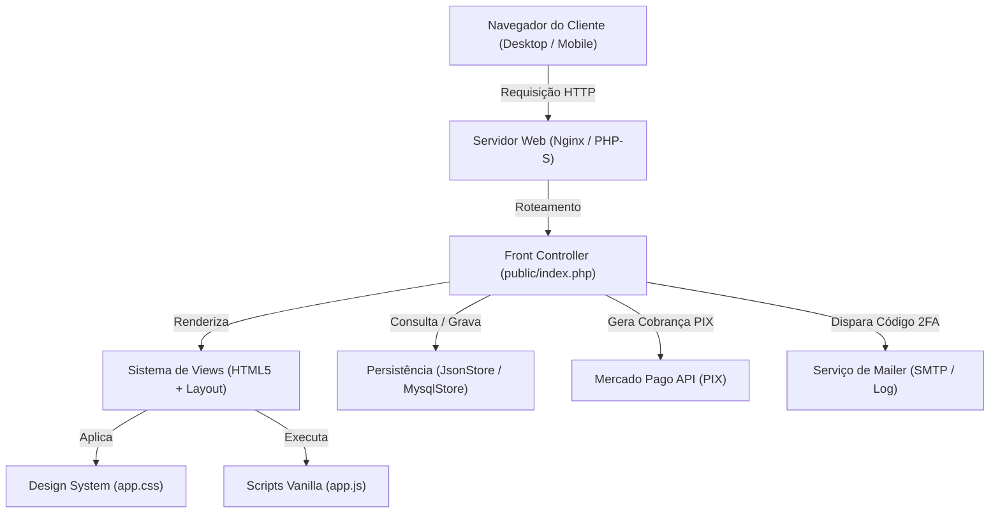

# 🎂 Elda Bolos e Doces — Documentação Técnica Completa do Sistema

> **Guia Arquitetural e Operacional Definitivo**  
> E-commerce responsivo e transacional para a confeitaria artesanal **Elda Bolos e Doces** (Sorocaba/SP).  
> Desenvolvido com foco em **HTML5 Semântico**, **CSS3 Nativo com Design System** e **JavaScript ES6+ Vanilla Puro** (Zero dependências no frontend).

---
## 📜 License(LICENSE)
[](https://github.com/rubensbelarmino/elda-doces/blob/main/LICENSE)
---
## 📑 Índice Geral

1. [Visão Geral e Identidade do Projeto](#-visão-geral-e-identidade-do-projeto)
2. [Arquitetura Tecnológica e Linguagens](#-arquitetura-tecnológica-e-linguagens)
3. [Foco Principal 1: HTML5 e Estrutura Semântica](#-foco-principal-1-html5-e-estrutura-semântica)
   - [Padrões de Acessibilidade (WCAG 2.1 AA & ARIA)](#padrões-de-acessibilidade-wcag-21-aa--aria)
   - [SEO e Dados Estruturados (Schema.org JSON-LD)](#seo-e-dados-estruturados-schemaorg-json-ld)
   - [Inventário Completo de Páginas e Componentes](#inventário-completo-de-páginas-e-componentes)
4. [Foco Principal 2: CSS3 e Arquitetura Visual (app.css)](#-foco-principal-2-css3-e-arquitetura-visual-appcss)
   - [Design Tokens (CSS Custom Properties)](#design-tokens-css-custom-properties)
   - [Tipografia e Escala Editorial](#tipografia-e-escala-editorial)
   - [Barra de Rolagem Personalizada (Candy Twist)](#barra-de-rolagem-personalizada-candy-twist)
   - [Componentes de UI Estilizados](#componentes-de-ui-estilizados)
   - [Animações e Efeitos Visuais (Keyframes)](#animações-e-efeitos-visuais-keyframes)
   - [Responsividade e Breakpoints do Layout](#responsividade-e-breakpoints-do-layout)
   - [Políticas de Redução de Movimento e Contraste](#políticas-de-redução-de-movimento-e-contraste)
5. [Foco Principal 3: JavaScript ES6+ Vanilla (app.js)](#-foco-principal-3-javascript-es6-vanilla-appjs)
   - [Filosofia Zero-Dependency & Padrão IIFE](#filosofia-zero-dependency--padrão-iife)
   - [Pré-carregamento Preditivo de Rotas (Prefetching)](#pré-carregamento-preditivo-de-rotas-prefetching)
   - [Menu Mobile com Gestão de Foco](#menu-mobile-com-gestão-de-foco)
   - [Lazy Loading de Imagens Base64 + Cache de Sessão](#lazy-loading-de-imagens-base64--cache-de-sessão)
   - [Máscaras Reativas de Entrada (Telefone, CEP, CPF)](#máscaras-reativas-de-entrada-telefone-cep-cpf)
   - [Cópia Inteligente do Código PIX (Clipboard API)](#cópia-inteligente-do-código-pix-clipboard-api)
   - [Avanço Automático no Input 2FA](#avanço-automático-no-input-2fa)
   - [Cronômetro Regressivo de Expiração](#cronômetro-regressivo-de-expiração)
   - [Sistema de Notificações Toast Temporizadas](#sistema-de-notificações-toast-temporizadas)
   - [Auto-Submit de Formulários Administrativos](#auto-submit-de-formulários-administrativos)
6. [Backend, Segurança e Armazenamento de Dados](#-backend-segurança-e-armazenamento-de-dados)
   - [PHP 8.4 Nativo e Front Controller](#php-84-nativo-e-front-controller)
   - [Persistência Híbrida: JsonStore vs. MysqlStore](#persistência-híbrida-jsonstore-vs-mysqlstore)
   - [Autenticação em Duas Etapas (2FA) e Mailer](#autenticação-em-duas-etapas-2fa-e-mailer)
   - [Checkout PIX e Webhooks Mercado Pago](#checkout-pix-e-webhooks-mercado-pago)
   - [Medidas de Segurança (CSRF, Rate Limiting, CSP, Bcrypt)](#medidas-de-segurança-csrf-rate-limiting-csp-bcrypt)
7. [Mapa Completo do Repositório (Árvore de Arquivos)](#-mapa-completo-do-repositório-árvore-de-arquivos)
8. [Como Executar o Projeto Localmente e em Produção](#-como-executar-o-projeto-localmente-e-em-produção)

---

## 🍰 Visão Geral e Identidade do Projeto

O site da **Elda Bolos e Doces** é uma solução completa de e-commerce gastronômico artesanal. O projeto foi projetado para traduzir a experiência acolhedora de uma confeitaria de alta linha para a web, com foco absoluto em velocidade de carregamento, clareza tipográfica, apelo visual dos produtos e segurança nas transações via PIX.

### Detalhes do Negócio
- **Marca**: Elda Bolos e Doces (Atelier de Confeitaria Artesanal)
- **Localização**: Av. Dr. Afonso Vergueiro, 2548, Vila Augusta, Sorocaba/SP
- **Tradição**: Desde 2009 atendendo a região de Sorocaba
- **Avaliação Google Maps**: **4,4 Estrelas** com mais de **1.300 avaliações** reais verificadas
- **Canais Integrados**: Loja Web própria, WhatsApp comercial, iFood e Instagram (`@eldabolosedoces`)



---

## 💻 Arquitetura Tecnológica e Linguagens

| Camada | Tecnologia | Descrição e Finalidade |
| :--- | :--- | :--- |
| **Estrutura** | **HTML5 Semântico** | Marcação nativa, rica em acessibilidade ARIA, metadados OpenGraph e microdados Schema.org. |
| **Estilização** | **CSS3 Nativo** | Vanilla CSS puro com Custom Properties (Tokens), Flexbox, CSS Grid, Shimmer loaders e Media Queries responsivas. Zero Tailwind ou frameworks pesados. |
| **Interatividade** | **JavaScript ES6+** | Vanilla JS puro encapsulado em IIFE. Pre-fetching inteligente de páginas, cache em `sessionStorage`, máscaras e IntersectionObserver. |
| **Backend** | **PHP 8.4 / 8.3** | Código estrito (`declare(strict_types=1);`), orientado a objetos, padrão MVC enxuto com Front Controller unificado. |
| **Armazenamento** | **JsonStore & MySQL 8.4** | Modo padrão em JSON local com `flock` atômico; comutável por `.env` para MySQL relacional com transações ACID. |
| **Pagamentos** | **Mercado Pago API v1** | Geração instantânea de QR Code PIX, string Copia-e-Cola e recepção de Webhooks com validação criptográfica de assinatura. |
| **E-mails & 2FA** | **Mailer Nativo** | Envio de códigos de segurança de 6 dígitos via SMTP autenticado (Gmail/Mailpit) ou fallback para logs locais. |
| **Web Server** | **Nginx / PHP-FPM / CLI** | Configuração para produção com balanceamento `least_conn` de 2 nós PHP, buffers otimizados e gzip. |

---

## 🧱 Foco Principal 1: HTML5 e Estrutura Semântica

A arquitetura de marcação prioriza **semântica nativa**, evitando o "div soup" e garantindo que motores de busca e tecnologias assistivas (leitores de tela como NVDA, JAWS e VoiceOver) compreendam a hierarquia lógica de cada página.

### Padrões de Acessibilidade (WCAG 2.1 AA & ARIA)

1. **Skip-Link de Acesso Rápido**:
   Localizado logo na abertura da tag `<body>`, permite que usuários de navegação por teclado saltem instantaneamente o menu e vão direto ao conteúdo útil:
   ```html
   <a class="skip-link" href="#conteudo-principal">Pular para o conteúdo principal</a>
   ```
2. **Regiões de Marco (Landmarks)**:
   - `<header class="site-header">`: Cabeçalho institucional.
   - `<nav class="main-nav" data-menu aria-label="Navegação principal">`: Menu de páginas.
   - `<main id="conteudo-principal">`: Ponto de ancoragem do conteúdo dinâmico.
   - `<section aria-labelledby="...">`: Seções identificadas por seus próprios títulos.
   - `<article class="product-card">` e `<article class="review-card">`: Entidades autônomas.
   - `<footer class="site-footer">`: Rodapé com contatos, políticas e links de navegação.
3. **Gerenciamento de Estado Dinâmico com ARIA**:
   - `aria-expanded="false"` e `aria-controls="menu-principal"` no botão do menu mobile.
   - `aria-live="polite"` em contêineres de feedback (`#a11y-status`) para avisos sonoros sem interromper a fala do leitor de tela.
   - `aria-current="page"` marcando o link da página em que o visitante se encontra.
4. **Textos Escondidos para Leitores de Tela (`.sr-only`)**:
   Elementos visuais abstratos (como o ícone da sacola ou o botão "+" de compra rápida) contêm rótulos descritivos ocultos para acessibilidade:
   ```html
   <button class="add-button" type="submit">
       <span class="sr-only">Adicionar Caixa Afeto à sacola</span>
       <span aria-hidden="true">+</span>
   </button>
   ```

### SEO e Dados Estruturados (Schema.org JSON-LD)

No arquivo `views/layout.php`, o cabeçalho injeta um schema canônico de negócio local para indexação rica no Google:
```html
<script type="application/ld+json">
{
  "@context": "https://schema.org",
  "@type": "Bakery",
  "name": "Elda Bolos e Doces",
  "image": "https://elda-doces.com/assets/images/hero-doces.png",
  "telephone": "+55 15 99745-1766",
  "address": {
    "@type": "PostalAddress",
    "streetAddress": "Av. Dr. Afonso Vergueiro, 2548",
    "addressLocality": "Sorocaba",
    "addressRegion": "SP",
    "postalCode": "18040-000",
    "addressCountry": "BR"
  },
  "aggregateRating": {
    "@type": "AggregateRating",
    "ratingValue": "4.4",
    "reviewCount": "1300"
  },
  "priceRange": "$$"
}
</script>
```

---

### Inventário Completo de Páginas e Componentes

```
views/
├── layout.php              # Shell Master (Head, Header, Toasts, WhatsApp Float, Footer)
├── home.php                # Vitrine Principal (Hero, Selos, Destaques, Avaliações, Vitrine)
├── catalog.php             # Cardápio Completo (Filtros, Busca, Grid de Produtos, Empty State)
├── product.php             # Página de Detalhe (Breadcrumbs, Foto HD, Porções, Compra)
├── cart.php                # Carrinho de Compras (Listagem, Incrementador, Resumo, Frete)
├── checkout.php            # Checkout Seguro (Endereço, Validação, Seleção de PIX)
├── order-success.php       # Tela de Confirmação (QR Code PIX, Copia-e-Cola, Timer)
├── account.php             # Área do Cliente (Dados cadastrais, Histórico e Rastreio)
├── status-index.php        # Catálogo de Diagnóstico e Telas HTTP
├── partials/
│   └── product-card.php    # Card Reutilizável de Produto com Preço e Imagem Otimizada
├── auth/
│   ├── login.php           # Formulário de Entrada com Split-Screen Editorial
│   ├── register.php        # Cadastro de Novo Cliente com Validação
│   └── two-factor.php      # Tela de Código de Segurança 2FA (6 dígitos)
├── admin/
│   ├── dashboard.php       # Painel de Métricas (Faturamento, Pedidos, Tabela de Produtos)
│   ├── orders.php          # Gerenciador Operacional de Pedidos e Alteração de Status
│   └── product-form.php    # Formulário Administrativo de Criação/Edição de Produtos
└── errors/
    └── status.php          # Página de Erro Amigável (400, 401, 403, 404, 429, 500, 503)
```

#### 1. Shell Principal (`views/layout.php`)
- **Barra de Anúncios (`.announcement`)**: Tarja superior de alto contraste informando atendimento e entregas em Sorocaba/SP.
- **Cabeçalho Fixo com Blur (`.site-header`)**: Efeito de vidro fosco (`backdrop-filter: blur(14px)`), logotipo em curvas tipográficas (`.brand-mark`), navegação e ícones rápidos.
- **Contador de Sacola (`.bag-link span`)**: Atualização visual da quantidade de itens adicionados ao carrinho.
- **Pilha de Notificações (`.toast-stack`)**: Área flutuante de mensagens de sucesso ou erro com auto-destruição.
- **Botão Flutuante do WhatsApp (`.whatsapp-float`)**: Acesso instantâneo ao suporte humano oficial.

#### 2. Página Inicial (`views/home.php`)
- **Hero Editorial**: Título estilizado, subtítulo descritivo, selo oficial de avaliação do Google (**4,4 ★ com +1.300 avaliações**) e botões de chamada primária ("Explorar Cardápio") e secundária ("Pedir no WhatsApp").
- **Faixa de Promessas (`.promise-strip`)**: Destaque para "Ingredientes Nobres", "Receitas de Família" e "Produção Diária em Sorocaba".
- **Grid de Produtos Selecionados (`.products-section`)**: 4 destaques da confeitaria com badges de preço e atalhos rápidos de compra.
- **História e Herança (`.story`)**: Bloco narrativo sobre a fundação em 2009, acompanhado do selo vintage circular `.seal` rotacionado.
- **Seção Oficial de Avaliações Google (`#avaliacoes`)**: 
  - Cartão de cabeçalho com o selo do Google e link direto para o Google Meu Negócio.
  - Grade com 4 depoimentos reais de clientes verificados (Mariana Silva, Carlos Eduardo, Juliana Ribeiro, Renato Almeida).
  - Botão de incentivo ("Deixe sua avaliação no Google ↗").
- **Galeria da Vitrine (`.elda-gallery`)**: Grid visual com produtos de chocolate e o logotipo oficial da confeitaria.
- **Ocasiões Especiais (`.occasion`)**: Cards de decisão ("01 Um carinho sem motivo", "02 Uma data para celebrar", "03 Um presente para encantar").
- **Localização e Atendimento (`.elda-contact`)**: Endereço na Vila Augusta e botões para WhatsApp, iFood e Instagram.

#### 3. Catálogo / Cardápio (`views/catalog.php`)
- **Filtros por Pílulas (`.category-pills`)**: Alternância rápida entre *Todos*, *Brigadeiros*, *Tortinhas*, *Macarons* e *Bolos*.
- **Barra de Pesquisa Instantânea (`.search-field`)**: Campo de texto com ícone SVG integrado.
- **Grade Responsiva (`.product-grid`)**: Distribuição adaptativa de itens com tratamento para estado vazio (`.empty-state`).

#### 4. Detalhe do Produto (`views/product.php`)
- **Galeria com Imagem em Alta Definição**: Tag da categoria flutuante, proporção preservada e tratamento visual de erro.
- **Informações do Doce**: Título, descrição minuciosa, preço à vista, preço comparativo e rendimento em porções.
- **Notas de Qualidade (`.detail-notes`)**: Blocos informativos com ícones de ingredientes frescos e produção diária.
- **Formulário de Compra**: Campo numérico de quantidade com limite de estoque e botão de adição à sacola.

#### 5. Carrinho e Checkout (`views/cart.php`, `views/checkout.php`)
- **Linhas do Carrinho (`.cart-line`)**: Foto do produto, título, porção, seletor de quantidade e link de remoção rápida.
- **Barra de Progresso do Frete (`.shipping-progress`)**: Elemento `<progress>` nativo estilizado que incentiva o cliente a atingir o frete grátis.
- **Resumo Fixo (`.order-summary`)**: Exibição de subtotal, frete calculado e valor total com badge de segurança.
- **Formulário de Checkout em 2 Passos**:
  - *Passo 1*: Dados do Destinatário (Nome, Telefone, E-mail, CPF, Endereço completo, Bairro, CEP e Complemento).
  - *Passo 2*: Seleção de Pagamento com a opção PIX em destaque.

#### 6. Sucesso do Pedido e PIX (`views/order-success.php`)
- **Badge de Confirmação**: Ícone animado de sucesso.
- **Código do Pedido**: Identificador alfanumérico destacado.
- **QR Code Dinâmico**: Imagem em alta resolução do QR Code gerado pelo Mercado Pago.
- **Código Copia-e-Cola**: Campo de texto protegido acompanhado do botão de cópia com feedback instantâneo.
- **Cronômetro Regressivo**: Tempo limite para liquidação do PIX antes do cancelamento do pedido.

#### 7. Painel Administrativo (`views/admin/`)
- **Dashboard (`dashboard.php`)**: 4 cartões com métricas em tempo real (Faturamento, Pedidos Pendentes, Clientes Cadastrados, Produtos Ativos) e tabela completa do catálogo com toggles de visibilidade e estoque.
- **Gestor de Pedidos (`orders.php`)**: Cartões detalhados por pedido contendo dados de entrega, itens selecionados, comprovante PIX e dropdown reativo para alteração imediata de status.
- **Cadastro/Edição de Produtos (`product-form.php`)**: Formulário com precificação em reais/centavos, slug automático, controle de estoque e seleção de fotos.

---

## 🎨 Foco Principal 2: CSS3 e Arquitetura Visual (app.css)

Todo o design do site foi construído do zero em **CSS3 moderno**, utilizando uma arquitetura escalável fundamentada em **Variáveis CSS (Design Tokens)**, respeitando contraste de cores estrito (**WCAG 2.1 AA**) e performance máxima de renderização sem reflows desnecessários.

### Design Tokens (CSS Custom Properties)

Definidos globalmente no seletor `:root` de `public/assets/app.css`:

```css
:root {
  /* Paleta Cromática Institucional */
  --wine:        #8d2949;   /* Tom vinho primário da marca */
  --wine-deep:   #4f162c;   /* Vinho profundo para cabeçalhos e fundos contrastados */
  --rose:        #ad3d5c;   /* Rosa vintage para destaques e detalhes */
  --blush:       #ead1cb;   /* Tom suave para bordas delicadas e acentos */
  --cream:       #fbf6ef;   /* Fundo principal quente e acolhedor */
  --paper:       #fffdf9;   /* Fundo branco-pérola dos cartões e formulários */
  --ink:         #2b201f;   /* Cor primária de texto (alto contraste: 12.8:1) */
  --muted:       #5e504d;   /* Texto secundário (contraste auditado: 7.1:1) */
  --gold:        #9e5f18;   /* Ouro nobre para estrelas e selos (contraste: 5.04:1) */
  --line:        rgba(79, 45, 42, .14); /* Linhas divisórias sutis */
  --green:       #45694d;   /* Verde botânico para estoque e aprovação */
  
  /* Elevação e Efeitos */
  --shadow:      0 24px 70px rgba(70, 35, 32, .11);
  
  /* Pilhas Tipográficas */
  --serif:       Georgia, 'Times New Roman', serif;
  --sans:        Inter, ui-sans-serif, system-ui, -apple-system, BlinkMacSystemFont, 'Segoe UI', sans-serif;
}
```

### Tipografia e Escala Editorial

- **Títulos e Ênfases (`--serif`)**: Usam a elegância atemporal da família serifada com proporções clássicas, kerning ajustado (`letter-spacing: -.04em`) e itálicos poéticos em tags `<em>` coloridas em `--wine`.
- **Textos de Apoio e Controles (`--sans`)**: Utilizam a clareza e alta legibilidade da fonte Inter e fontes de sistema modernas.
- **Tipografia Fluida (`clamp`)**: O tamanho dos títulos adapta-se suavemente à largura da tela sem saltos bruscos:
  ```css
  .hero h1 {
    font: 400 clamp(54px, 6vw, 85px) / .96 var(--serif);
    letter-spacing: -.04em;
  }
  ```

---

### Barra de Rolagem Personalizada (Candy Twist)

Inspirada nas clássicas bengalas de doces e tubos confeitados, a barra de rolagem foi esculpida com gradientes repetidos e reflexo de brilho translúcido:

```css
/* Trilho com listras suaves */
::-webkit-scrollbar-track {
  background: repeating-linear-gradient(135deg, #fff4dc 0 8px, #f8e8d7 8px 16px);
  border-left: 1px solid rgba(111, 29, 59, .08);
}

/* Polegar (Thumb) confeitado multicolorido com reflexo de luz */
::-webkit-scrollbar-thumb {
  min-height: 58px;
  border: 3px solid #f3e5dd;
  border-radius: 999px;
  background:
    linear-gradient(112deg, transparent 0 35%, rgba(255,255,255,.62) 42% 48%, transparent 55%),
    repeating-linear-gradient(135deg,
      #ff5b8d 0 8px,
      #ffd34f 8px 16px,
      #57d7bd 16px 24px,
      #73a8ff 24px 32px,
      #ff9855 32px 40px,
      #ff5b8d 40px 48px) !important;
  box-shadow: inset 0 0 0 1px rgba(111, 29, 59, .18), 0 2px 5px rgba(111, 29, 59, .16);
}
```

---

### Componentes de UI Estilizados

1. **Botões Interativos (`.button`, `.button-primary`, `.button-outline`)**:
   - Altura tátil mínima de 50px (em conformidade com as diretrizes do Google Lighthouse).
   - Efeito de elevação suave no hover (`transform: translateY(-2px);`).
   - Sombra difusa colorida na cor vinho (`box-shadow: 0 12px 30px rgba(111, 29, 59, .18);`).
2. **Cards de Produto (`.product-card`)**:
   - Área da imagem com `aspect-ratio: 1 / 1.03` e `overflow: hidden`.
   - Efeito de aproximação óptica suave na foto ao passar o mouse (`transform: scale(1.045);`).
   - Selo flutuante de categoria com efeito translúcido `backdrop-filter: blur(8px)`.
3. **Cards de Avaliações Google (`.review-card`)**:
   - Fundo nobre em papel texturizado com bordas sutis.
   - Cabeçalho com avatar circular individual com iniciais do cliente.
   - Estrelas em tom dourado acessível (`--gold`).
   - Efeito de flutuação no hover (`transform: translateY(-4px); box-shadow: 0 16px 36px rgba(70, 35, 32, .08);`).
4. **Ilustração de Erro em CSS Puro (`.error-dessert`)**:
   - Um bolo de confeitaria montado inteiramente com pseudo-elementos e bordas CSS (`border-radius`, sombras inset e cereja dourada), eliminando a necessidade de carregar imagens pesadas em páginas de status de erro.

---

### Animações e Efeitos Visuais (Keyframes)

#### Efeito Shimmer para Placeholder de Imagens
Enquanto uma imagem é transferida e decodificada, o elemento exibe um gradiente reluzente contínuo:
```css
img[data-base64-image] {
  background: linear-gradient(110deg, #eadbd1 8%, #f8eee7 18%, #eadbd1 33%);
  background-size: 220% 100%;
  animation: image-shimmer 1.25s linear infinite;
}

@keyframes image-shimmer {
  to { background-position-x: -220%; }
}

img[data-base64-image].is-loaded {
  background: none;
  animation: none;
}
```

#### Efeito de Entrada de Notificações Toast
```css
@keyframes toast-in {
  from {
    opacity: 0;
    transform: translateY(-12px);
  }
}
```

---

### Responsividade e Breakpoints do Layout

O layout foi desenvolvido no paradigma **Mobile-Friendly / Responsive Design**, operando com fluidez através de 4 faixas principais:

| Breakpoint | Alvo de Dispositivo | Principais Adaptações de Layout |
| :--- | :--- | :--- |
| **> 1000px** | Desktops e Laptops | Grid de 4 colunas em produtos e avaliações; sidebar administrativa fixa de 230px; resumos de pedido colunados à direita. |
| **max-width: 1000px** | Laptops Compactos / Tablets Paisagem | Grid de produtos e avaliações migra para 2 colunas; métricas do admin dividem-se em 2x2. |
| **max-width: 900px** | Tablets Retrato | Carrinho e checkout colapsam as colunas laterais, posicionando o resumo de valores abaixo do formulário de endereço. |
| **max-width: 760px** | Smartphones | O menu horizontal é substituído pelo menu gaveta (drawer) com animação; hero tem sua tipografia reduzida para 55px; botões ocupam a largura total; cabeçalho encolhe para 71px. |
| **max-width: 430px** | Telas Pequenas | Grid de produtos vira 2 colunas compactas com botões expandidos; o botão de WhatsApp vira um botão circular flutuante de 48x48px. |

---

### Políticas de Redução de Movimento e Contraste

O CSS inclui uma salvaguarda para usuários que configuraram seus sistemas operacionais para reduzir animações (por condições vestibulares ou sensibilidade a movimento):

```css
@media (prefers-reduced-motion: reduce) {
  *, *::before, *::after {
    scroll-behavior: auto !important;
    animation: none !important;
    transition: none !important;
  }
}
```

Além disso, todos os elementos interativos possuem anel de foco visível destacado para quem navega por tecla `TAB`:
```css
:focus-visible {
  outline: 2px solid var(--wine) !important;
  outline-offset: 2px !important;
}
```

---

## ⚡ Foco Principal 3: JavaScript ES6+ Vanilla (app.js)

O arquivo `public/assets/app.js` reúne toda a inteligência do lado do cliente. Foi escrito estritamente em **Vanilla JavaScript moderno**, sem qualquer biblioteca ou dependência externa (zero npm, zero bundler, zero runtime overhead). Seu peso é de apenas ~6.9 KB, executando de forma instantânea.

### Filosofia Zero-Dependency & Padrão IIFE

Todo o código é encapsulado em uma Função Imediatamente Invocada (IIFE), garantindo isolamento de escopo absoluto:
```javascript
(() => {
  'use strict';
  // Todo o ecossistema de scripts vive isolado aqui.
})();
```

---

### Pré-carregamento Preditivo de Rotas (Prefetching)

O script monitora quando o cursor do mouse ou o toque do usuário se aproxima de links de alta conversão (`/entrar`, `/criar-conta`, `/carrinho`). Antes mesmo do clique ser concluído, o documento é solicitado em segundo plano e fica pronto no cache do navegador:

```javascript
const prefetched = new Set();
const prefetchPage = (href) => {
  if (!href || prefetched.has(href) || !/^\/(entrar|criar-conta|carrinho)$/.test(href)) return;
  prefetched.add(href);
  const link = document.createElement('link');
  link.rel = 'prefetch';
  link.as = 'document';
  link.href = href;
  document.head.appendChild(link);
};

document.querySelectorAll('a[href="/entrar"], a[href="/criar-conta"], a[href="/carrinho"]').forEach((anchor) => {
  ['pointerenter', 'focusin', 'touchstart'].forEach((eventName) => {
    anchor.addEventListener(eventName, () => prefetchPage(anchor.getAttribute('href')), { once: true, passive: true });
  });
});
```

---

### Menu Mobile com Gestão de Foco

O drawer mobile cumpre integralmente os requisitos de acessibilidade da W3C:
1. Altera `aria-expanded` entre `"true"` e `"false"`.
2. Adiciona a classe `.menu-open` ao `<body>` para congelar o scroll do fundo da página enquanto o menu está aberto.
3. Move o foco do teclado automaticamente para o primeiro link do menu ao abrir.
4. Devolve o foco ao botão hamburguer ao fechar.
5. Suporta fechamento imediato pela tecla **Escape**.
6. Fecha automaticamente caso o usuário clique em qualquer área fora do menu.

```javascript
const toggle = document.querySelector('[data-menu-toggle]');
const menu = document.querySelector('[data-menu]');

const closeMenu = () => {
  if (toggle?.getAttribute('aria-expanded') === 'true') {
    toggle.setAttribute('aria-expanded', 'false');
    menu?.classList.remove('is-open');
    document.body.classList.remove('menu-open');
    toggle.focus();
  }
};

toggle?.addEventListener('click', () => {
  const open = toggle.getAttribute('aria-expanded') === 'true';
  toggle.setAttribute('aria-expanded', String(!open));
  menu?.classList.toggle('is-open', !open);
  document.body.classList.toggle('menu-open', !open);
  if (!open) {
    menu?.querySelector('a')?.focus();
  }
});

document.addEventListener('keydown', (e) => {
  if (e.key === 'Escape') closeMenu();
});

document.addEventListener('click', (e) => {
  if (menu?.classList.contains('is-open') && !menu.contains(e.target) && !toggle?.contains(e.target)) {
    closeMenu();
  }
});
```

---

### Lazy Loading de Imagens Base64 + Cache de Sessão

Para otimizar o consumo de banda e garantir transições instantâneas entre páginas sem recarregar bytes repetidos de fotos de bolos e doces:

1. **Cache em `sessionStorage`**: As imagens requisitadas via API são salvas em memória de sessão (`doce:image:filename`). Quando o usuário visita outra página (ex: do Cardápio para o Carrinho), a imagem surge imediatamente do storage local sem tráfego de rede. O cache é descartado automaticamente quando a aba é fechada.
2. **Deduplicação de Requisições Simultâneas**: Se o mesmo produto aparece duas vezes na mesma tela, um `Map` de promises (`imageRequests`) impede que duas requisições paralelas sejam disparadas.
3. **IntersectionObserver por Proximidade**: Carrega as imagens 420px antes de entrarem no campo visual do usuário (`rootMargin: '420px 0px'`), garantindo que a foto já esteja renderizada antes de o scroll alcançá-la.
4. **Prioridade Crítica**: Imagens marcadas com `data-image-priority="high"` (os 4 primeiros produtos da vitrine) furam a fila e carregam imediatamente.

```javascript
const imageRequests = new Map();
const readSession = (key) => { try { return window.sessionStorage.getItem(key); } catch { return null; } };
const writeSession = (key, value) => { try { window.sessionStorage.setItem(key, value); } catch { /* quota cheia ou navegação anônima */ } };

const loadBase64Image = (img) => {
  if (img.dataset.imageRequested === '1') return;
  img.dataset.imageRequested = '1';
  const filename = img.dataset.base64Image;
  if (!filename || !/^[a-z0-9-]+\.(jpg|webp)$/.test(filename)) return;
  const key = `doce:image:${filename}`;
  const cached = readSession(key);
  if (cached) {
    img.src = cached;
    img.classList.add('is-loaded');
    return;
  }
  if (!imageRequests.has(filename)) {
    imageRequests.set(filename, fetch(`/api/imagens/${encodeURIComponent(filename)}`, { credentials: 'same-origin', cache: 'no-store' })
      .then(response => {
        if (!response.ok) throw new Error('Imagem indisponível');
        return response.json();
      })
      .then(({ data }) => {
        if (typeof data !== 'string' || !data.startsWith('data:image/')) throw new Error('Formato inválido');
        writeSession(key, data);
        return data;
      }));
  }
  imageRequests.get(filename)
    .then((data) => {
      img.src = data;
      img.classList.add('is-loaded');
    })
    .catch(() => img.closest('.product-image, .detail-image, .cart-line')?.classList.add('image-error'));
};
```

---

### Máscaras Reativas de Entrada (Telefone, CEP, CPF)

Formatam os campos automaticamente conforme o cliente digita, higienizando caracteres especiais sem impedir a edição:

```javascript
// Telefone (reconhece dinamicamente 8 ou 9 dígitos no celular)
const phone = document.querySelector('input[name="phone"]');
phone?.addEventListener('input', () => {
  const digits = phone.value.replace(/\D/g, '').slice(0, 11);
  phone.value = digits.length > 10
    ? digits.replace(/(\d{2})(\d{5})(\d{0,4})/, '($1) $2-$3')
    : digits.replace(/(\d{2})(\d{4})(\d{0,4})/, '($1) $2-$3');
});

// CEP (XXXXX-XXX)
const zip = document.querySelector('input[name="zip"]');
zip?.addEventListener('input', () => {
  const digits = zip.value.replace(/\D/g, '').slice(0, 8);
  zip.value = digits.replace(/(\d{5})(\d{0,3})/, '$1-$2');
});

// CPF (XXX.XXX.XXX-XX)
const cpf = document.querySelector('input[name="cpf"]');
cpf?.addEventListener('input', () => {
  const digits = cpf.value.replace(/\D/g, '').slice(0, 11);
  cpf.value = digits
    .replace(/(\d{3})(\d)/, '$1.$2')
    .replace(/(\d{3})(\d)/, '$1.$2')
    .replace(/(\d{3})(\d{1,2})$/, '$1-$2');
});
```

---

### Cópia Inteligente do Código PIX (Clipboard API)

Permite copiar o código com um único toque no celular ou desktop, empregando `navigator.clipboard.writeText` com fallback para `document.execCommand('copy')`:

```javascript
document.querySelector('[data-copy-pix]')?.addEventListener('click', async (event) => {
  const input = document.querySelector('#pix-code');
  if (!input) return;
  try {
    await navigator.clipboard.writeText(input.value);
    event.currentTarget.textContent = 'Código copiado ✓';
  } catch {
    input.select();
    document.execCommand('copy');
    event.currentTarget.textContent = 'Código copiado ✓';
  }
});
```

---

### Avanço Automático no Input 2FA

Na tela de verificação de duas etapas (`views/auth/two-factor.php`), o campo de código aceita apenas números e, assim que o 6º dígito é preenchido, direciona o foco imediatamente para o botão de confirmação:

```javascript
const codeInput = document.querySelector('.code-input');
codeInput?.addEventListener('input', () => {
  codeInput.value = codeInput.value.replace(/\D/g, '').slice(0, 6);
  if (codeInput.value.length === 6) {
    codeInput.form?.querySelector('button[type="submit"]')?.focus();
  }
});
```

---

### Cronômetro Regressivo de Expiração

Usado para controlar o tempo de validade do PIX e do código 2FA. Atualiza o relógio a cada 1.000 ms e adiciona a classe `.expired` quando o tempo se esgota:

```javascript
const countdown = document.querySelector('[data-countdown]');
if (countdown) {
  const tick = () => {
    const remaining = Math.max(0, Number(countdown.dataset.expires) - Math.floor(Date.now() / 1000));
    countdown.textContent = `${String(Math.floor(remaining / 60)).padStart(2, '0')}:${String(remaining % 60).padStart(2, '0')}`;
    if (remaining === 0) countdown.closest('.code-help')?.classList.add('expired');
  };
  tick();
  window.setInterval(tick, 1000);
}
```

---

### Sistema de Notificações Toast Temporizadas

Toasts de sucesso ou erro são exibidos e, após 4,8 segundos, recebem a classe `.toast-out` para desaparecerem suavemente com CSS. O cliente também pode fechá-los a qualquer momento clicando no botão "×":

```javascript
document.querySelectorAll('.toast button').forEach((button) => {
  button.addEventListener('click', () => button.closest('.toast')?.remove());
});
window.setTimeout(() => {
  document.querySelectorAll('.toast').forEach((toast) => toast.classList.add('toast-out'));
}, 4800);
```

---

### Auto-Submit de Formulários Administrativos

No painel de gerenciamento de pedidos, qualquer alteração no seletor de status dispara o envio do formulário sem necessidade de botões "Salvar" manuais:

```javascript
document.querySelectorAll('[data-auto-submit]').forEach((select) => {
  select.addEventListener('change', () => select.form?.submit());
});
```

---

## 🔒 Backend, Segurança e Armazenamento de Dados

### PHP 8.4 Nativo e Front Controller
Toda a aplicação é roteada pelo Front Controller `public/index.php`. O roteamento é construído sobre funções puras e controllers semânticos no namespace `App\` em `src/`.

### Persistência Híbrida: JsonStore vs. MysqlStore
A classe abstrata `Store` (`src/Store.php`) define o contrato unificado de dados. O sistema implementa dois adaptadores intercambiáveis:
1. **`JsonStore` (`storage/data.json`)**:
   - Ideal para execução local, testes e demonstração sem depender da instalação de bancos externos.
   - Opera com concorrência segura através de bloqueio exclusivo de arquivo (`flock($fp, LOCK_EX)`).
2. **`MysqlStore`**:
   - Projetado para produção sob alta concorrência.
   - Utiliza tabelas relacionais (`users`, `products`, `orders`, `order_items`, `two_factor_codes`) definidas em `database/schema-v2.sql`.

### Autenticação em Duas Etapas (2FA) e Mailer
- Todos os logins e cadastros exigem confirmação via código aleatório de 6 dígitos enviado por e-mail.
- Os códigos possuem expiração temporal de 10 minutos, controle de tentativas e cooldown de reenvio.
- Os códigos são assinados com HMAC através da chave `APP_KEY`.
- Durante desenvolvimento, o script `php bin/latest-2fa.php` permite inspecionar no terminal o último código gerado sem precisar abrir a caixa de e-mail.

### Checkout PIX e Webhooks Mercado Pago
- Integração nativa com a API oficial do Mercado Pago (`src/MercadoPagoGateway.php`).
- Criação de pagamentos com tipo `payment_method_id = 'pix'`.
- Notificações de pagamento em tempo real recebidas em `/webhooks/mercado-pago`.
- Validação estrita da assinatura do webhook (`X-Signature` e `X-Request-Id`) com o `MERCADO_PAGO_WEBHOOK_SECRET` para prevenir fraudes.

### Medidas de Segurança
- **Bcrypt**: Todas as senhas de clientes e administradores são hasheadas com `password_hash($pass, PASSWORD_BCRYPT)`.
- **CSRF Token**: Validação de token em todos os formulários `POST`.
- **Rate Limiting**: O componente `RateLimiter` (`src/RateLimiter.php`) protege rotas de autenticação, permitindo até 2.000 requisições antes de aplicar bloqueio temporário de 5 minutos por IP.
- **CSP (Content-Security-Policy)**: Cabeçalhos estritos que barram injeção de scripts não autorizados, XSS e framing não permitido (`X-Frame-Options: DENY`).

---

## 📂 Mapa Completo do Repositório (Árvore de Arquivos)

```
projeto/
├── .agents/                    # Regras, workflows e configurações dos assistentes de IA
│   ├── rules/
│   │   └── graphify.md         # Regra mandatória de sincronização do knowledge graph
│   └── workflows/
│       └── graphify.md         # Workflow de indexação com Graphify
├── bin/
│   └── latest-2fa.php          # Utilitário CLI para inspecionar o último código 2FA emitido
├── database/
│   └── schema-v2.sql           # DDL relacional para MySQL de produção
├── docker/
│   ├── nginx.conf              # Configuração Nginx com balanceamento least_conn para Docker
│   ├── nginx-local.conf        # Configuração Nginx para balanceamento local sem containers
│   ├── php.ini                 # Diretivas de produção (OPcache, limites de upload, timezone)
│   └── proxy-headers.conf      # Cabeçalhos de repasse de IP real e SSL para proxies reversos
├── public/                     # Raiz pública (Document Root da aplicação)
│   ├── index.php               # Front Controller, roteamento HTTP e tratamento de rotas
│   ├── assets/
│   │   ├── app.css             # Folha de estilos completa, tokens, animações e layout
│   │   ├── app.js              # Toda a lógica Vanilla JS, lazyload, máscaras e clipboard
│   │   └── images/             # Banco de imagens estáticas e fotos de vitrine
│   │       ├── caramelo.jpg    # Foto: Bolo Caramelo Dourado
│   │       ├── chocolate.jpg   # Foto: Brigadeiros Belga e Trufas
│   │       ├── elda-chocolate.jpg # Foto: Vitrine de Chocolate
│   │       ├── elda-doces.jpg  # Foto: Variedade de Doces Finos
│   │       ├── elda-logo.jpg   # Logotipo oficial da Elda Bolos e Doces
│   │       ├── elda-morango.jpg# Foto: Balcão e Doces com Morango
│   │       ├── favicon.svg     # Ícone vetorial da aba do navegador
│   │       ├── hero-doces.png  # Imagem principal da seção Hero
│   │       ├── hero-doces.webp # Versão compactada em WebP para alta performance
│   │       ├── morango.jpg     # Foto: Tartelette Lumière
│   │       └── pistache.jpg    # Foto: Macarons de Pistache
├── src/                        # Núcleo da Aplicação (Backend)
│   ├── bootstrap.php           # Inicialização de ambiente, sessão, helpers e injeção de dependências
│   ├── Mailer.php              # Camada de disparo de e-mails (SMTP, PHP mail, log em disco)
│   ├── MercadoPagoGateway.php  # Cliente HTTP para API de pagamentos PIX e validação de webhooks
│   ├── RateLimiter.php         # Controle de taxa de requisições e proteção contra força bruta
│   └── Store.php               # Classes abstratas e concretas de repositório (JsonStore & MysqlStore)
├── storage/                    # Armazenamento volátil e banco local
│   ├── data.json               # Base de dados padrão em JSON (produtos, usuários, pedidos)
│   ├── logs/                   # Logs de acesso e depuração do Nginx/PHP
│   └── mail/                   # Caixa de saída dos e-mails locais do sistema
├── views/                      # Camada de Apresentação (Templates HTML / PHP)
│   ├── layout.php              # Shell com header, footer, a11y skip-link e schema.org
│   ├── home.php                # Página inicial completa (Hero, Provas sociais, Vitrine)
│   ├── catalog.php             # Catálogo filtrável por categorias com pesquisa
│   ├── product.php             # Página individual do produto
│   ├── cart.php                # Carrinho de compras com barra de frete
│   ├── checkout.php            # Checkout em duas etapas para PIX
│   ├── order-success.php       # Confirmação com QR Code PIX e código copia-e-cola
│   ├── account.php             # Perfil do cliente e rastreamento de pedidos
│   ├── status-index.php        # Índice de páginas de teste e erro
│   ├── partials/
│   │   └── product-card.php    # Card individual de produto
│   ├── auth/
│   │   ├── login.php           # Tela de login
│   │   ├── register.php        # Tela de registro de usuário
│   │   └── two-factor.php      # Tela de autenticação 2FA
│   ├── admin/
│   │   ├── dashboard.php       # Painel administrativo com faturamento e produtos
│   │   ├── orders.php          # Gestão e despacho operacional de pedidos
│   │   └── product-form.php    # Formulário de criação/edição de produtos
│   └── errors/
│       └── status.php          # Template padrão de respostas de erro HTTP (404, 500, etc.)
├── router.php                  # Roteador para o servidor embutido do PHP CLI
├── Dockerfile                  # Imagem base PHP 8.4-FPM para conteinerização
├── docker-compose.yml          # Orquestração do cluster (2 nós PHP-FPM + Nginx + Mailpit + MySQL)
├── install.sh                  # Script de instalação e checagem de dependências Linux
├── start.sh                    # Script de inicialização do ambiente local balanceado
└── README.md                   # Esta documentação técnica
```

---

## 🌐 Acesso ao Projeto

- **Website Oficial**: [https://elda-doces.com](https://elda-doces.com)

---

*Documentação mantida pela equipe técnica de desenvolvimento da Elda Bolos e Doces.*  
*Última atualização: Setembro de 2026.*

